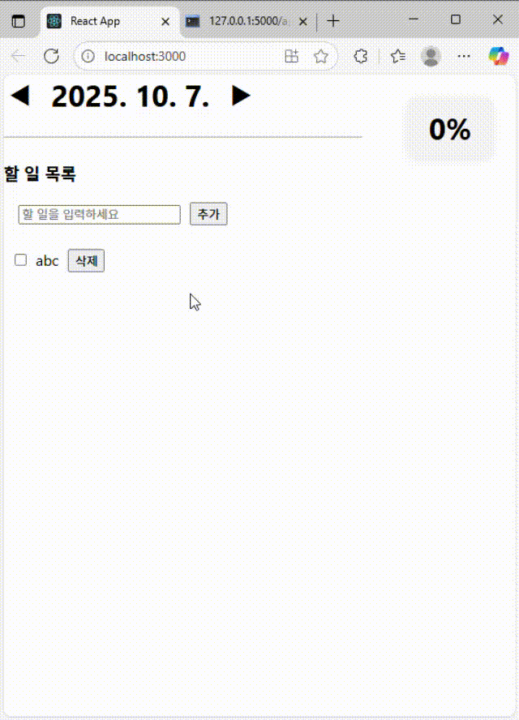

📋 Todo List 웹앱 (Todo List Web App)

  

이 프로젝트는 날짜별로 할 일을 관리하고, 완료 진행률을 실시간으로 확인할 수 있는 간단한 Todo List 웹앱입니다.
할 일 추가, 삭제, 완료 체크, 날짜 이동, 진행률 표시 등 기본적인 기능을 제공합니다.
  
This project is a simple Todo List web app that lets you manage tasks by date and view real-time completion progress.
You can add, delete, check tasks as completed, move between dates, and see the progress bar.

